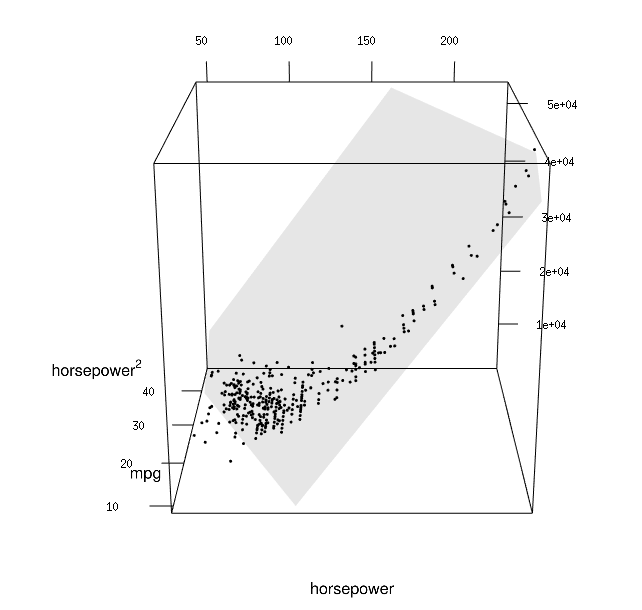

# Linear regression {#linear-regression}

A linear regression is a model for the conditional mean of a response variable $Y$ as a function of $p$ explanatory variables (also termed regressors or covariates),
\begin{align}
\mathsf{E}(Y \mid \mathbf{X})=\beta_0 + \beta_1\mathrm{X}_{1} + \cdots + \beta_p \mathrm{X}_{p}. (\#eq:linearreg)
\end{align}
The mean of $Y$ is conditional on the values of the observed covariate $\mathbf{X}$; this amounts to treating them as non-random,  known in advance.

In practice, any model is an approximation of reality. An error term is included to take into account the fact that no exact linear relationship links $\mathbf{X}$ and $Y$ (otherwise this wouldn't be a statistical problem), or that measurements of $Y$ are subject to error. The random error term $\varepsilon$ will be the source of information for our inference, as it will quantify the goodness of fit of the model.

We can rewrite the linear model in terms of the error for a random sample of size $n$: denote by $Y_i$ the value of the response for observation $i$, and $\mathrm{X}_{ij}$ the value of of the $j$th explanatory variable of observation $i$. The model is 
\begin{align}
Y_i = \beta_0 + \beta_1 \mathrm{X}_{i1} + \ldots + \beta_p \mathrm{X}_{ip} +\varepsilon_{i}, \qquad i =1, \ldots, n, (\#eq:olsmean)
\end{align}
where $\varepsilon_i$ is the additive error term specific to observation $i$. While we may avoid making distributional assumption about $\varepsilon_i$, we nevertheless fix its expectation to zero to encode the fact we do not believe the model is systematically off,, so $\mathsf{E}(\varepsilon_i \mid \boldsymbol{X}_i)=0$ $(i=1, \ldots, n)$.

One important remark is that the model is linear in the coefficients $\boldsymbol{\beta}\in \mathbb{R}_{p+1}$, not in the explanatory variables! the latter are arbitrary and could be (nonlinear) functions of other explanatory variables, for example $\mathrm{X}=\ln(\texttt{years})$, $\mathrm{X}=\texttt{horsepower}^2$ or $\mathrm{X}= \mathsf{I}_{\texttt{man}}\cdot\mathsf{I}_{\texttt{full}}$. The mean of the response is specified as a  **linear combination of explanatory variables**. This is at the core of the flexibility of the linear regression, which is used mainly for the following purposes:


1.  Evaluate the effects of covariates $\mathbf{X}$ on the mean response
of $Y$.
2. Quantify the influence of the explanatories $\mathbf{X}$ on the
response and test for their significance.
3. Predict the response for new sets of explanatories $\mathbf{X}$.


## Introduction

Linear regression is the most famous and the most widely used statistical model around.  The name may appear reductive, but many tests statistics (*t*-tests, ANOVA, Wilcoxon, Kruskal--Wallis) [can be formulated using a linear regression](https://lindeloev.github.io/tests-as-linear/linear_tests_cheat_sheet.pdf), while [models as diverse as trees, principal components and deep neural networks are just linear regression model in disguise](https://threadreaderapp.com/thread/1286420597505892352.html). What changes under the hood between one fancy model to the next are the optimization method (e.g., ordinary least squares, constrained optimization or stochastic gradient descent) and the choice of variables entering the model (spline basis for nonparametric regression, indicator variable selected via a greedy search for trees, activation functions for neural networks). 

This chapter explores the basics of linear regression, parameter interpretation and testing for coefficients and sub-models. Analysis of variance will be presented as special case of linear regression.

To make concepts and theoretical notions more concrete, we will use data from a study performed in a college in the United States. The goal of the administration who collected these information was to investigate potential gender inequality in the salary of faculty members. The data contains the following variables:

-   `salary`: nine-month salary of professors during the 2008--2009 academic year (in thousands USD).
-   `rank`: academic rank of the professor (`assistant`, `associate` or `full`).
-   `field`: categorical variable for the field of expertise of the professor, one of `applied` or `theoretical`.
-   `sex`: binary indicator for sex, either `man` or `woman`.
-   `service`: number of years of service in the college.
-   `years`: number of years since PhD.

Before drafting a model, a quick look at the data is in due order. If salary increases with year, there is more heterogeneity in the salary of higher ranked professors: logically, assistant professors are either promoted or kicked out after at most 6 years according to the data. The limited number of years prevents large variability for their salaries.

```{r edacollege, eval = TRUE, echo = FALSE, fig.cap = "Exploratory data analysis of $\\texttt{college}$ data: salaries of professors as a function of the number of years of service and the academic ranking"}
data(college, package = "hecstatmod")
p1 <- ggplot(college, aes(y = salary, x = rank)) + 
  geom_boxplot() +
  xlab("academic ranking") +
  ylab("salary (in thousands USD)")
p2 <- ggplot(college, aes(x = service, y = salary, col = sex)) + 
  geom_point() + 
  facet_wrap(~ rank, scales = "free") +
  xlab("years of service") +
  ylab("salary (in thousands USD)") + 
  theme(legend.position = "bottom")
library(patchwork)
p1 + p2 + plot_layout(width = c(1,3))
```

Salary increases over years of service, but its variability also increases with rank. Note the much smaller number of women in the sample: this will impact our power to detect differences between sex. A contingency table of sex and academic rank can be useful to see if the proportion of women is the same in each rank: women represent `r round(100*11/(56+11),0)`\% of assistant professors and `r round(100*10/(54+10),0)`\% of associate profs, but only `r round(100*18/(248+18),0)`\% of full professors and these are better paid on average.

```{r tableaucontingence, eval = TRUE, echo = FALSE, fig.align = "center"}
knitr::kable(table(college$sex, college$rank), 
             caption = "Contingency table of the number of prof in the college by sex and academic rank.",
             booktabs = TRUE)
```


The simple linear regression model only includes a single explanatory variable and defines a straight line linking two variables $\mathrm{X}$ and $Y$ by means of an equation of the form $y=a+bx$; Figure \@ref(fig:droitenuage) shows the line passing through the scatterplot for years of service.


```{r droitenuage, eval =TRUE, echo = FALSE, fig.cap = "Simple linear regression model for the salary of professors as a function of the number of years of service; the line is the solution of the least squares problem."}
library(hecstatmod)
lmprof <- lm(salary ~ service, data = college)
ggplot(data = college, aes(x = service, y = salary)) + 
  geom_point() +
  geom_smooth(method = "lm", formula = "y ~ x",  se = FALSE, col = "black") + 
  labs(x = "years of service", 
       y = "salary (in thousands USD)")
```


## Ordinary least squares

The ordinary least square estimators $\widehat{\boldsymbol{\beta}}=(\widehat{\beta}_0, \ldots, \widehat{\beta}_p)$ are the values that simultaneously minimize the Euclidean distance between the random observations $Y_i$ and the **fitted values** 
\begin{align*}
 \widehat{Y}_i &= \widehat{\beta}_0 + \widehat{\beta}_1 \mathrm{X}_{i1} + \cdots + \widehat{\beta}_p \mathrm{X}_{ip}, \qquad i =1, \ldots, n.
\end{align*}
In other words, the least square estimators are the solution of the convex optimization problem
\begin{align*}
\widehat{\boldsymbol{\beta}} &=\min_{\boldsymbol{\beta} \in \mathbb{R}^{p+1}}\sum_{i=1}^n (Y_i-\widehat{Y}_i)^2= \min_{\boldsymbol{\beta}} \|\boldsymbol{Y}-\mathbf{X}\boldsymbol{\beta}\|^2
\end{align*}
This system of equations has an explicit solution which is better expressed using matrix notation: this amounts to expressing equation \@ref(eq:olsmean) with one observation per line.


Consider the matrices
\begin{align*}
\boldsymbol{Y} =
 \begin{pmatrix}
  Y_1 \\
  Y_2 \\
  \vdots \\
  Y_n 
 \end{pmatrix} ,
 \;
 \boldsymbol{\varepsilon} =
 \begin{pmatrix}
  \varepsilon_1 \\
  \varepsilon_2 \\
  \vdots \\
  \varepsilon_n 
 \end{pmatrix} ,
 \;
\mathbf{X} = \begin{pmatrix}
\mathrm{X}_{11} & \mathrm{X}_{12} & \cdots & \mathrm{X}_{1p} \\
\mathrm{X}_{21} & \mathrm{X}_{22} & \cdots & \mathrm{X}_{2p} \\
\vdots & \vdots & \ddots & \vdots \\
\mathrm{X}_{n1} & \mathrm{X}_{n2} & \cdots & \mathrm{X}_{np} 
\end{pmatrix} , \;
\boldsymbol{\beta} =
 \begin{pmatrix}
  \beta_1 \\
  \beta_2 \\
  \vdots \\
  \beta_p 
 \end{pmatrix}
\end{align*}
The model in compact form is
\begin{align*}
\boldsymbol{Y} = \mathbf{X} \boldsymbol{\beta} + \boldsymbol{\varepsilon}.
\end{align*}
The ordinary least squares estimator solves the unconstrained optimization problem
\begin{align*}
\widehat{\boldsymbol{\beta}}=\min_{\boldsymbol{\beta} \in \mathbb{R}^{p+1}}(\boldsymbol{y}-\mathbf{X}\boldsymbol{\beta})^\top(\boldsymbol{y}-\mathbf{X}\boldsymbol{\beta}).
\end{align*}
and a proof is provided [in the Appendix](#ols). If the $n \times (p+1)$ matrix  $\mathbf{X}$ is full-rank, we obtain a unique solution to the optimization problem, 
\begin{align}
\widehat{\boldsymbol{\beta}} = (\mathbf{X}^{\top} \mathbf{X})^{-1} \mathbf{X}^{\top} \boldsymbol{Y}. (\#eq:ols)
\end{align}

What does the solution to the least squares problem represent in two dimensions? The estimator is the one minimizing the sum of squared residuals: the $i$th **ordinary residual** $e_i = y_i -\widehat{y}_i$ is the *vertical* distance between a point $y_i$ and the fitted value $\widehat{y}_i$ on the line; the blue segments on Figure \@ref(fig:distancevert) represent the individual vectors of residuals.

```{r distancevert, eval = TRUE, echo = FALSE, fig.cap = "Illustration of ordinary residuals added to the regression line (blue vectors)."}
ols <- lm(salary ~ service, data = college)
res <- resid(ols)
vlines <- data.frame(x1 = college$service, y1 = fitted(ols), y2 = fitted(ols)+ res)
ggplot(data = college, aes(x = service, y = salary)) + 
        geom_point() +  
  geom_smooth(method = "lm", se = FALSE, col ="black") +
   labs(x = "years of service", 
       y = "salary (in thousands USD)") +
        geom_segment(aes(x = x1, y = y1, xend = x1, yend = y2), arrow= arrow(length = unit(0.2,"cm")), color = hecblue, 
                     data = vlines, show.legend = FALSE) 

```

```{remark, label = "remark-projection", name = "Geometry of least squares"}
If we consider the $n$ observations as a (column) vector, the term $\mathbf{X} \widehat{\boldsymbol{\beta}}$ is the projection of the response vector $\boldsymbol{y}$ on the linear span generated by the columns of $\mathbf{X}$, $\mathscr{S}_{\mathbf{X}}$. The ordinary residuals are thus orthogonal to $\mathscr{S}_{\mathbf{X}}$ and to the fitted values, meaning $\boldsymbol{e}^\top\widehat{\boldsymbol{y}}=0$. 
A direct consequence of this fact is that the linear correlation between $\boldsymbol{e}$ and $\widehat{\boldsymbol{y}}$ is zero; we will use this property to build graphical diagnostics.
```

```{remark, label = "remark-OLScosts", name = "Complexity of ordinary least squares"}
This is an aside: in machine learning, you will often encounter linear models fitted using a (stochastic) gradient descent algorithm. Unless your sample size $n$ or the number of covariates $p$ is significant (think at the Google scale), an approximate should not be prefered to the exact solution! From a numerical perspective, obtaining the least square estimates requires inverting a $(p+1) \times (p+1)$ matrix $\mathbf{X}^\top\mathbf{X}$, which is the most costly operation. In general, direct inversion should be avoided because it is not the most numerically stable way of obtaining the solution. **R** uses the QR decomposition, which has a complexity of $\mathrm{O}(np^2)$. Another more stable alternative, which has the same complexity but is a bit more costly is use of a singular value decomposition.
```

Any good software will calculate ordinary least square estimates for you. Keep in mind that there is an explicit and unique solution provided your design matrix $\mathbf{X}$ doesn't contain collinear columns. If you have more than one explanatory variable, the fitted values lie on a hyperplan (which is hard to represent graphically). Mastering the language and technical term (fitted values, ordinary residuals, etc.) is necessary for the continuation.


## Interpretation of the model parameters

What do the $\boldsymbol{\beta}$ parameters of the linear model represent? In the simple case presented in Figure \@ref(fig:droitenuage), the equation of the line is $\widehat{Y} = \widehat{\beta}_0 + \widehat{\beta}_1\mathrm{X}_1$, $\beta_0$ is the intercept (the mean value of $Y$ when $\mathrm{X}_1=0$) and $\beta_1$ is the slope, i.e., the average increase of $Y$ when $\mathrm{X}_1$ increases by one unit.

In some cases, the intercept is **meaningless** because the value $\mathrm{X}_1=0$ is impossible (e.g., $\mathrm{X}_1$ represents the height of a human). In the same vein, there may be no observation in a neighborhood of  $\mathrm{X}_1=0$, even if this value is plausible, in which case the intercept is an **extrapolation**.

If the columns of $\mathbf{X}$ are arbitrary, it is customary to include an intercept: this amounts to including $\mathbf{1}_n$ as column of the design matrix $\mathbf{X}$. Because the residuals are orthogonal to the columns of $\mathbf{X}$, their mean is zero, since  $n^{-1}\mathbf{1}_n^\top\boldsymbol{e}=\bar{\boldsymbol{e}}=0$. In general, we could also obtain mean zero residuals by including a set of vectors in $\mathbf{X}$ that span $\mathbf{1}_n$.

In our example, the equation of the fitted line of Figure \@ref(fig:droitenuage) is \[\widehat{\texttt{salary}} = `r coef(lmprof)[1]` + `r coef(lmprof)[2]`\texttt{service}.\]
The average salary of a new professor would then be `r 1000*coef(lmprof)[1]` dollars, whereas the average annual increase for each additional year of service is `r 1000*coef(lmprof)[2]` dollars.

If the response variable $Y$ should be continuous (for the least square criterion to be meaningful), we place no such restriction on the explanatories. The case of dummies in particular is common: these variables are encoded using binary indicators ($0/1$). Consider for example the sex of the professors in the study:
\[\texttt{sex} = \begin{cases} 0 , & \text{for men},\\
1, & \text{for women.}
\end{cases}
\]
The equation of the simple linear model that includes the binary variable $\texttt{sex}$ is $\texttt{salary} = \beta_0 + \beta_1 \texttt{sex} + \varepsilon$. Let $\mu_0$ denote the average salary of mean and $\mu_1$ that of women. The intercept $\beta_0$ can be interpreted as usual: it is the average salary when $\texttt{sex}=0$, meaning that $\beta_0=\mu_0$. We can write the equation for the conditional expectation for each sex,
\begin{align*}
\mathsf{E}(\texttt{salary} \mid \texttt{sex})= \begin{cases}
\beta_0, & \texttt{sex}=0 \text{ (men)}, \\
\beta_0 + \beta_1 & \texttt{sex}=1 \text{ (women)}.
\end{cases}
\end{align*}
A linear model that only contains a binary variable $\mathrm{X}$ as regressor amounts to specifying a different mean for each of two groups: the average of women is $\mathsf{E}(\texttt{salary} \mid \texttt{sex}=1) = \beta_0 + \beta_1 = \mu_1$ and $\beta_1=\mu_1-\mu_0$ represents the difference between the average salary of men and women. The least square estimator $\widehat{\beta}_0$ is the sample mean of men and $\widehat{\beta}_1$ is the difference of the sample mean of women and men. The parametrization of the linear model with $\beta_0$ and $\beta_1$ is in terms of **contrasts** and is particularly useful if we want to test for mean difference between the groups, as this amounts to testing $\mathscr{H}_0: \beta_1=0$. If we wanted our model to directly output the sample means, we would need to replace the design matrix $\mathbf{X}=[\mathbf{1}_n, \texttt{sex}]$ by $[\mathbf{1}_n- \texttt{sex},  \texttt{sex}]$. The fitted model would be the same because they span the same 2D subspace, but this is not recommended because software treat cases without intercept differently and it can lead to unexpected behaviour (more on this latter).

```{r graphcollegesex, eval = TRUE, echo = FALSE, fig.cap = "Simple linear model for the $\\texttt{college}$ data using the binary variable sex as regressor: even if the equation defines a line, only its values in $0/1$ are realistic."}
college$sexbin <- as.integer(relevel(college$sex, ref = "man")) - 1L
coefs <- coef(lm(data = college, salary ~ sexbin))
ggplot(data = college, aes(x = sexbin, y = salary, group = sex)) + 
  see::geom_violindot(aes(col = sex), position_dots = position_jitter(width = 0.05)) +
  geom_abline(intercept = coefs[1], slope = coefs[2]) + 
   scale_x_continuous(breaks = 0:1,
                     limits = c(-0.1,1.5),
                     labels = 0:1) + 
  theme(legend.position = c(.95, .95),
    legend.justification = c("right", "top")) + 
  labs(x = "sex", y = "salary (in thousand USD)") + 
  stat_summary(fun = mean, aes(col = sex))
```

If we fit the model with sex only to the `college` data, we find that the average salary of men is $\widehat{\beta}_0=`r mean(college$salary[college$sex == "man"])*1000`$ USD and the mean difference estimate of the salary between women and men is $\widehat{\beta}_1=`r 1000*((mean(college$salary[college$sex == "man"])-mean(college$salary[college$sex == "woman"])))`$ dollars. Since the estimate is negative, this means women are paid less. Bear in mind that the model is not adequate for determining if there are gender inequalities in the salary distribution: \@ref(fig:droitenuage) shows that the number of years of service and the academic rank strongly impact wages, yet the distribution of men and women is not the same within each rank.

Even if the linear model defines a line, the latter is only meaningful when evaluated at $0$ or $1$; Figure \@ref(fig:graphcollegesex) shows it in addition to sample observations (jittered) and a density estimate for each sex. The colored dot represents the mean, showing that the line does indeed pass through the mean of each group.
<!-- http://easysas.blogspot.com/2011/10/sas-how-to-draw-added-variable-plot.html 
: certains logiciels, **R** en tête, modifient les sorties et ne présentent plus le coefficient de détermination car il n'est pas donné que les résidus soient centrés. -->

A binary indicator is a categorical variable with two levels, so we could extend our reasoning and fit a model with a categorical explanatory variable with $k$ levels. To do this, we add $k-1$ indicator variables plus the intercept: if we want to model a different mean for each of the $k$ groups, it is logical to only include $k$ parameters in the mean model. We will choose, as we did with sex, a **reference category** or **baseline** whose average will be encoded by the intercept $\beta_0$. The other parameters $\beta_1, \ldots, \beta_{k-1}$ are contrasts relative to the baseline. The college data includes the ordinal variable `rank`, which has three levels (assistant, associate and full). We thus need two binary variables, $\mathrm{X}_1 = \mathsf{I}(\texttt{rank}=\texttt{associate})$ and $\mathrm{X}_2 = \mathsf{I}(\texttt{rank}=\texttt{full})$; the $i$th element of the vector $\mathrm{X}_1$ is one for an associate professor and zero otherwise. The linear model is
\begin{align*}
\texttt{salary} =\beta_0 + \beta_1 \mathrm{X}_1+\beta_2\mathrm{X}_2 + \varepsilon,
\end{align*}
and the conditional expectation of salary
\begin{align*}
\mathsf{E}(\texttt{salary} \mid \texttt{rank})= \begin{cases}
\beta_0, & \texttt{rank}=\texttt{assistant},\\
\beta_0 + \beta_1 & \texttt{rank}=\texttt{associate},\\
\beta_0 + \beta_2 & \texttt{rank}=\texttt{full},
\end{cases}
\end{align*}
Thus $\beta_1$ (respectively $\beta_2$) are the difference between the average salary of associate (respectively full) professors and assistant professors. The choice of the baseline category is arbitrary and all choices yield the same model: only the interpretation changes from one parametrization to the next. For an ordinal variable, it is recommended to choose the smallest or the largest category to ease comparisons.

The models we have fitted so far are not adequate because they ignore variables that are necessarily to correctly explain variations in salaries: Figure \@ref(fig:edacollege) show for example that rank is critical for explaining the salary variations in the college. We should thus fit a model that include those simultaneously to investigate the gender gap (which consists of differences that are unexplained by other factors). Before doing this, we come back to the interpretation of the parameters in the multiple linear regression setting.

Consider the model $Y= \beta_0 + \beta_1 \mathrm{X}_1 + \cdots + \beta_p\mathrm{X}_p + \varepsilon$. The intercept  $\beta_0$ represents the mean value of $Y$ when *all* of the covariates are set to zero,
\begin{align*}
\beta_0 &= \mathsf{E}(Y \mid \mathrm{X}_1=0,\mathrm{X}_2=0,\ldots,\mathrm{X}_p=0).
\end{align*}
For categorical variables, this yields the baseline, whereas we fix the continous variables to zero: again, this may be nonsensical depending on the study. The coefficient $\beta_j$ $(j \geq 1)$ can be interpreted as the mean increase of the response $Y$ when $\mathrm{X}_j$ increases by one unit, all other things being equal (*ceteris paribus*); e.g., 
\begin{align*}
\beta_1 &= \mathsf{E}(Y \mid \mathrm{X}_1=x_1+1,\mathrm{X}_2=x_2,\ldots,\mathrm{X}_p=x_p) \\
& \qquad \qquad - \mathsf{E}(Y \mid \mathrm{X}_1=x_1,\mathrm{X}_2=x_2,\ldots,\mathrm{X}_p=x_p) \\
&= \left\{\beta_0 + \beta_1 (x_1+1) + \beta_2 x_2 + \cdots +\beta_p \mathrm{X}_p \right\} \\
& \qquad \qquad -\left\{\beta_0 + \beta_1 x_1 + \beta_2 x_2 + \cdots +\beta_p \mathrm{X}_p \right\} 
\end{align*}
It is not always possible to fix the value of an explanatory if multiple columns of $\mathbf{X}$ contains functions/transformations of it. For example, if we included a polynomial of order $k$ for some variable $\mathrm{X}$,
\begin{align*}
Y=\beta_0+ \beta_1 \mathrm{X}+ \beta_2 \mathrm{X}^2 + \ldots +\beta_k \mathrm{X}^k + \varepsilon.
\end{align*}
If we include a term of order $k$, $\mathrm{X}^k$, we must *always* include the lower order terms $1, \mathrm{X}, \ldots, \mathrm{X}^{k-1}$ to make sure the resulting model is interpretable (otherwise, it amounts to a particular class of polynomials with some zero coefficients). Interpreting nonlinear effects (even polynomials, for which $k\leq 3$ in practice), is complicated because the effect of an increase of one unit of $\mathrm{X}$ *depends of the value of the latter*. 

```{example, label="auto", name = "Auto data"}
We consider a linear regression model for the fuel autonomy of cars as a function of the power of their motor (measured in horsepower) from the `auto` dataset. The postulated model,
\[
\texttt{mpg}_i = \beta_0 + \beta_1 \texttt{horsepower}_i + \beta_2 \texttt{horsepower}_i^2 + \varepsilon_i,
\]
 includes a quadratic term. Figure \@ref(fig:autoquad2d) shows the scatterplot with the fitted regression line, above which the line for the simple linear regression for horsepower is added.
```

```{r autoquad2d, echo = FALSE, fig.cap = "Linear regression models for the fuel autonomy of cars as a function of motor power"}
data(auto, package = "hecstatmod")
mod <- lm(mpg ~ horsepower + I(horsepower^2),  data = auto)
ggplot(data = auto, aes(x = horsepower, y = mpg)) + 
  geom_point() + 
  geom_smooth(method = "lm", formula = "y ~ x", se = FALSE, col = heccyan) + 
  labs(x = "horsepower", 
       y = "fuel autonomy (in miles per US gallon)") +
      geom_line(data = data.frame(horsepower = auto$horsepower, fitted = mod$fitted),
                aes(horsepower, fitted, col = hecblue), show.legend = FALSE)
```

It appears graphically that the quadratic model fits better than the simple linear alternative: we will assess this hypothesis formally later. For the degree two polynomial, Figure \@ref(fig:autoquad2d) show that fuel autonomy decreases rapidly when power increases between 50 to 100, then more slow until 189.35 hp. After that, the model postulates that autonomy increases again as evidenced by the scatterplot, but beware of extrapolating (weird things can happen beyond the range of the data, as exemplified by [Hassett's cubic model for the number of daily cases of Covid19 in the USA](https://livefreeordichotomize.com/2020/05/05/model-detective/)). 

The representation in Figure \@ref(fig:autoquad2d) may seem counter-intuitive given that we fit a linear model, but it is a 2D projection of 3D coordinates for the equation $\beta_0 + \beta_1x-y +\beta_2z =0$, where $x=\texttt{horsepower}$, $z=\texttt{horsepower}^2$ and $y=\texttt{mpg}$. Physics and common sense force $z = x^2$, and so the fitted values lie on a curve in a 2D subspace of the fitted plan, as shown in grey in the 3D Figure \@ref(fig:hyperplan).

```{r hyperplan_config, echo = FALSE, eval = FALSE}
knitr::knit_hooks$set(webgl = hook_webgl)
```

```{r hyperplan, echo = FALSE, fig.cap = "3D graphical representation of the linear regression model for the $\texttt{auto}$ data.", cache = TRUE}
out_type <- knitr::opts_knit$get("rmarkdown.pandoc.to")
if(out_type == 'html'){
library(rgl)
plot3d(y = auto$mpg, x = auto$horsepower, z = I(auto$horsepower^2),
          xlab = expression("horsepower"), 
          ylab = expression("mpg"), 
          zlab = expression(paste("horsepower"^{2})),
          axis.col = rep("black", 3))
ols <- coef(mod)
ran <- range(auto$horsepower)
hor_seq <- seq(from = ran[1], to = ran[2], length = 1000)
hor2_seq <- hor_seq^2
mpg_seq <- ols[1] + ols[2]*hor_seq + ols[3]*hor2_seq

points3d(x = hor_seq, z = hor2_seq, y = mpg_seq, col = hecblue)
planes3d(a = ols[2], c = ols[3], b = -1, d = ols[1], alpha = 0.1)
rglwidget()
} else{
  
}
```

```{remark, label = "remark-spline", name = "There are better alternatives to polynomials for modelling nonlinear effects"}
Generally speaking, one uses flexible basis vectors (splines) rather than polynomials for smoothing when the relation between the response $Y$ and an explanatory variable $\mathrm{X}$ is nonlinear; these models involve many covariates and it is customary to add a penalty term to control for overfitting and wiggliness. A better (physical) understanding of the system, or a theoretical model can also guide the choice of functions to use.
```

The coefficient $\beta_j$ in Eq. \@ref(eq:linearreg) represents the *marginal* contribution of $\mathrm{X}_j$ when all the other covariates are included in the model and which is not explained by them. This can be represented graphically by projecting $Y$ and $\mathrm{X}_j$ in the orthogonal complement of $\mathbf{X}_{-j}$ (the matrix containing all but the $j$th column $\mathrm{X}_j$). The **added-variable plot** is a graphical tool showing this projection: the residuals from the linear regression of $Y$ onto $\mathscr{S}(\mathbf{X}_{-j})$ are mapped to the $y$-axis, whereas the residuals from the linear regression of $\mathrm{X}_j$ as a function of $\mathbf{X}_{-j}$ are shown on the $x$-axis. The regression line passes through ($0,0$) and its slope is $\hat{\beta}_j$. This graphical diagnostic is useful for detecting collinearity and the impact of outliers.

```{example, label = "inequite-salariale", name = "Wage inequality in an American college"}
We consider a multiple regression model for the `college` data that includes sex, academic rank, field of study and the number of years of service as regressors.
```

If we multiply $\texttt{salary}$ by a thousand to get the resulting estimates in US dollars, the postulated model is
\begin{align*}
\texttt{salary}\times 1000 &= \beta_0 + \beta_1 \texttt{sex}_{\texttt{woman}} +\beta_2 \texttt{field}_{\texttt{theoretical}} \\&\quad +\beta_3 \texttt{rank}_{\texttt{associate}}
+\beta_4 \texttt{rank}_{\texttt{full}}  +\beta_5 \texttt{service} + \varepsilon.
\end{align*}
```{r collegecoefs, eval = TRUE, echo = FALSE}
college$sex <- relevel(x = college$sex, ref = "man")
college_lm <- lm(salary ~ sex + field + rank + service , data = college)
coefs_college_lm <- round(1000*coef(college_lm),0)
names(coefs_college_lm) <- paste0("$\\widehat{\\beta}_",0:5,"$")
knitr::kable(t(coefs_college_lm), caption = "Estimated coefficients of the linear model for the $\\texttt{college}$ (in USD, rounded to the nearest dollar).", booktabs = TRUE, escape = FALSE)
```

The interpretation of the coefficients is as follows:

- The estimated intercept is $\widehat{\beta}_0=`r coefs_college_lm[1]`$ dollars; it corresponds to the mean salary of men assistant professors who just started the job and works in an applied domain.
- everything else being equal (same field, academic rank, and number of years of service), the estimated salary difference between a woman and is estimated at $\widehat{\beta}_1=`r coefs_college_lm[2]`$ dollars. 
- *ceteris paribus*, the salary difference between a professor working in a theoretical field and one working in an applied field is $\beta_2$ dollars: our estimate of this difference is $`r coefs_college_lm[3]`$ dollars, meaning applied pays more than theoretical.
- *ceteris paribus*, the estimated mean salary difference between associate and assistant professors is $\widehat{\beta}_3=`r coefs_college_lm[4]`$ dollars.
- *ceteris paribus*, the estimated mean salary difference between full and assistant professors is $\widehat{\beta}_4=`r coefs_college_lm[5]`$ dollars.
- au sein d'un même échelon, chaque année supplémentaire de service mène à une augmentation de salary annuelle moyenne de $\widehat{\beta}_5=`r coefs_college_lm[6]`$ dollars.

All other factors taken into account, women get paid less than men. It remains to see if this difference is statistically significant. Perhaps more surprising, the model estimates that salary decreases with every additional year of service: this seems counterintuitive when looking at Figure \@ref(fig:droitenuage), which showed a steady increas of salary over the years. However, this graphical representation is misleading because Figure \@ref(fig:edacollege) showed that academic ranking mattered the most. Once all the other factors are accounted for, years of service serves to explain the salary of full professors who have been working unusual amounts of time and who gain less than the average full professor, as shown by the added-variable plot of Figure \@ref(fig:avplotcollege).

```{r avplotcollege, eval = TRUE, echo = FALSE, fig.cap = "Added-variable plot for years of service in the linear regression model of the  $\\texttt{college}$ data."}
car::avPlots(model = college_lm, "service", xlab= "years of service | rest", ylab = "salary | rest", bty = "l", pch = 19, col = scales::alpha("black", 0.3))
```

[Details about implementation of linear models using **R** are provided in the Appendix](#rlmfunc).


## Tests for parameters of the linear model {#test-lm}


We need to make further assumptions in order to carry out inference and build testing procedures for the mean model parameters of the linear model.  In order to get a tractable distribution for test statistics, it is customary to assume that the disturbances $\boldsymbol{\varepsilon}$ are independent normal random variables with mean zero and common variance $\sigma^2$. It follows that $Y_1, \ldots, Y_n$ are conditionally *independent* random variables with
\begin{align*}
\mathsf{E}(Y_i \mid \mathbf{X}_i)=\beta_0 + \sum_{j=1}^p \mathrm{X}_{ij}\beta_j, \quad  \mathsf{Va}(Y_i\mid \mathbf{X}_i)= \sigma^2, \quad i=1, \ldots, n.    
\end{align*}
Under this hypothesis, the least square estimators for the mean parameters coincide with the maximum likelihood estimators. The advantage of imposing this (more stringent than necessary) assumption is that we can use our toolbox for testing. The theory underlying likelihood tests is presented in the chapter on [likelihood-based inference](likelihood). Assuming normal errors leads to exact distributions for the test statistics (which also coincide with the asymptotic ones in large samples). 


Of particular interest are tests of restrictions for components of $\boldsymbol{\beta}$. The large sample properties of the maximum likelihood estimator imply that
\begin{align*}
\widehat{\boldsymbol{\beta}} \stackrel{\cdot}{\sim}\mathsf{No}_{p+1}\left\{\boldsymbol{\beta}, \sigma^2(\mathbf{X}^\top\mathbf{X})^{-1}\right\}
\end{align*}
for sufficiently large sample size. One can thus easily estimate the standard errors from the matrix upon replacing $\sigma^2$ by an estimator, typically the unbiased estimator of the variance.

In an inferential setting, it’s often important to test whether the effect of an explanatory variable is significant: if $\mathrm{X}_j$ is binary or continuous, the test for $\mathscr{H}_0: \beta_j=0$ corresponds to a null marginal effect for $\mathrm{X}_j$. The null model is a linear regression in which we remove the $(j+1)$st column of $\mathbf{X}$, so both models are nested. The Wald test statistic is reported by most software $W=\widehat{\beta}_j/\mathsf{se}(\widehat{\beta}_j)$ and the null distribution is Student-_t_ with $n-p-1$ degrees of freedom, which explains the terminology ($t$ values). In addition to coefficient estimates, it is possible to obtain confidence intervals for $\beta_j$, which are the usual $\widehat{\beta}_j \pm t_{n-p-1,\alpha/2} \mathsf{se}(\widehat{\beta}_j)$, with $t_{n-p-1,\alpha/2}$ denoting the $1-\alpha/2$ quantile of the $\mathsf{St}_{n-p-1}$ distribution. 


For categorical variables with more than two levels, testing if $\beta_j=0$ is typically not of interest because the contrast represent the different between the category $\mathrm{X}_j$ and the baseline: these two categories could have a small difference, but the categorical variable as a whole may still be a useful predictor given the other explanatories. The hypothesis of zero contrast is awkward because it implies a null model in which selected categories are merged. 


### *F*-tests for comparison of nested linear models {#ftestslm}

Consider the *full* linear model which contains $p$ predictors,
\begin{align*}
\mathbb{M}_1: Y=\beta_0+\beta_1 \mathrm{X}_1 + \cdots + \beta_g \mathrm{X}_g + \beta_{k+1}\mathrm{X}_{k+1} + \ldots + \beta_p \mathrm{X}_p + \varepsilon.
\end{align*}
Suppose without loss of generality that we want to test $\mathscr{H}_0: \beta_{k+1}=\beta_{k+2}=\ldots=\beta_p=0$ (one could permute columns of the design matrix to achieve this configuration).
The global hypothesis specifies that $(p-k)$ of the $\beta$ parameters are zero. The *restricted model* corresponding to the null hypothesis contains only the covariates for which $\beta_j \neq 0$,
\begin{align*}
\mathbb{M}_0: Y=\beta_0+\beta_1 \mathrm{X}_1 + \ldots + \beta_k \mathrm{X}_k + \varepsilon.
\end{align*}
Let $\mathsf{SS}_e(\mathbb{M}_1)$ be the residuals sum of squares for model $\mathbb{M}_1$,
\begin{align*}
\mathsf{SS}_e(\mathbb{M}_1)=\sum_{i=1}^n (Y_i-\hat{Y}_i^{\mathbb{M}_1})^2,
\end{align*}
where $\hat{Y}_i^{\mathbb{M}_1}$ is the $i$th fitted value from $\mathbb{M}_1$. Similarly define $\mathsf{SS}_e(\mathbb{M}_0)$ for the residuals sum of square of $\mathbb{M}_0$. Clearly, $\mathsf{SS}_e(\mathbb{M}_0) \geq \mathsf{SS}_e(\mathbb{M}_1)$ (why?)


The $F$-test statistic is
\begin{align*}
F=\frac{\{\mathsf{SS}_e(\mathbb{M}_0)-\mathsf{SS}_e(\mathbb{M}_1)\}/(p-k)}{\mathsf{SS}_e(\mathbb{M}_1)/(n-p-1)}
\end{align*}
Under $\mathscr{H}_0$, the $F$ statistic follows a [Fisher distribution](https://en.wikipedia.org/wiki/F-distribution) with $(p-k)$ and $(n-p-1)$ degrees of freedom, $\mathsf{F}(p-k, n-p-1)$ ---  $p-k$ is the number of restrictions, $n-p-1$ is sample size minus the number of $\beta$'s in $\mathbb{M}_1$. 

It turns out that both $F$ and $t$-statistics are equivalent for testing a single coefficient $\beta_j$: the $F$-statistic is the square of the Wald statistic and they lead to the same inference --- the $p$-value for the test are identical. While it may get reported in tables, the test for $\beta_0=0$ is not of interest; we keep the intercept merely to centre the residuals.

For normal linear regression, the likelihood ratio test for comparing models $\mathbb{M}_1$ and $\mathbb{M}_0$ is a function of the sum of squared residuals: the usual formula simplifies to $R = n\ln\{\mathsf{SS}_e(\mathbb{M}_0)/\mathsf{SS}_e(\mathbb{M}_1)\}$. This is reminiscent of the $F$-statistic formula and the two are in fact intimately related modulo null distribution and scaling. The $t$-tests and $F$-tests presented above could thus both be viewed as particular cases of [likelihood-based tests](liktests).


Consider the `college` data example and the associated linear model with `rank`, `sex`, years of `service` and `field` as covariates.
```{r summarytestslmcollege, echo = FALSE }
library(kableExtra)
options(knitr.kable.NA = '')
library(pixiedust)
names(college_lm$coefficients)[2:5] <- c("sex [woman]","field [theoretical]","rank [associate]", "rank [full]")
dust(college_lm) %>%
  sprinkle(col = 2:3, round = 3) %>%
  sprinkle(col = 4, round = 2) %>% 
  sprinkle(col = 5, fn = quote(pvalString(value))) %>% 
  sprinkle_colnames(estimate = "estimate", 
                     std.error = "std. error",
                     statistic = "Wald stat.", 
                     p.value = "p-value") %>% 
  sprinkle_bookdown() %>%
  kable(align = "lrrrr", booktabs = TRUE, caption = "Table of linear regression coefficients with associated standard errors, Wald tests and _p_-values based on Student-_t_ distribution")
```

Table \@ref(tab:summarytestslmcollege) shows the estimated coefficients (in thousands of dollars). The coefficients are the least squares estimates $\widehat{\boldsymbol{\beta}}$, the standard errors are the square root of the diagonal elements of $S^2(\mathbf{X}^\top\mathbf{X})^{-1}$. The Wald (or _t_-) statistic is simply $W=\widehat{\beta}/\mathsf{se}(\widehat{\beta})$ for $\mathscr{H}_0: \beta_j=0$: given two of the three estimates, we could easily recover the third using the formula for the test. The $p$-values are for the two-sided alternative test with $\mathscr{H}_a: \beta_j \neq 0$.

The interpretation is usual: $p$-values that are less than our prescribed level $\alpha$ do not contribute significantly given the other variables already in the model. Neither years of service nor sex are statistically different from zero given all the other variables. The test for $\beta_{\texttt{sex}}$ is comparing the model with all covariates (including service), and vice-versa. Note that the conclusion changes depending on the model: both coefficients would be statistically significant had we removed rank from the set of covariates, because they are correlated. The gender imbalance among ranks explains most of the gap between sex, whereas year of service is largely redundant once we account for the jumps due to change of academic rank. 


```{r summaryanovalmcollege, echo = FALSE, fig.cap = "Sum of square decomposition comparing nested models with and without covariates: sum of squares, number of parameters, _F_-statistic and _p_-value."}
dust(car::Anova(college_lm, type=3), 
     keep_rownames = TRUE) %>% 
  sprinkle(col = 2, round = 1) %>% 
  sprinkle(col = 4, round = 2) %>% 
  sprinkle(col = 5, fn = quote(pvalString(value))) %>% 
  sprinkle_colnames('.rownames' = "variable",
                    'Sum Sq' = "sum of square", 
                     'Df' = "df",
                     'F value' = "F stat.", 
                     "Pr(>F)" = "p-value")  %>% 
knitr::kable(caption = "Type 3 sum of square decomposition table: sum of square decomposition comparing nested models with and without covariates, _F_-statistic and associated _p_-value.", booktabs = TRUE, align = c("lrrrr"))
```

Table \@ref(tab:summaryanovalmcollege) gives the $F$-statistics values and the associated $p$-values. The sum of squares represent the difference $\mathsf{SS}_e(\mathbb{M}_0)-\mathsf{SS}_e(\mathbb{M}_1)$ for various null models $\mathbb{M}_0$, except the last line for residuals which reports $\mathsf{SS}_e(\mathbb{M}_1)$. You can verify that (up to rounding) these $p$-pvalues are identical to those of the Wald test in the output when `df=1`. The only categorical variable here with more than one level is `rank`, and it is strongly significant: removing it from the model leads to a sharp decrease in fit. 

We could have also easily computed the likelihood ratio test to compare the models: for example, the log-likelihood for the full model is `r as.numeric(logLik(college_lm))` and that of the model without rank is `r as.numeric(logLik(update(college_lm, ~.-rank)))`, so the likelihood ratio statistic would be `r 2*(as.numeric(logLik(college_lm))-as.numeric(logLik(update(college_lm, ~.-rank))))` and this is strongly significant when compared to the $\chi^2_2$ distribution (both likelihood ratio test and $F$-test give a $p$-value of $2.2 \times 10^{-16}$).

## Coefficient of determination {#coefR2}

When we specify a model, the error term $\boldsymbol{\varepsilon}$ accounts for the fact no perfect linear relationship characterizes the data (if it did, we wouldn't need statistic to begin with). Once we have fitted a model, we estimate the variance $\sigma^2$; one may then wonder which share of the total variance in the sample is explained by the model.

The total sum of squares, defined as the sum of squared residuals from the intercept-only model, serves as comparison --- the simplest model we could come up with would involving every observation by the sample mean of the response and so this gives (up to scale) the variance of the response, $\mathsf{SS}_c = \sum_{i=1}^n (y_i - \overline{y})^2$. We can then compare the variance of the original data with that of the residuals from the model with covariate matrix $\mathbf{X}$, defined as $\mathsf{SS}_e =\sum_{i=1}^n e_i^2$ with $e_i = y_i - \widehat{\beta}_0 - \sum_{j=1}^p \widehat{\beta}_j\mathrm{X}_j$. 
We define the coefficient of determination, or squared multiple correlation coefficient of the model, $R^2$, as
\begin{align*}
R^2 = 1- \frac{\mathsf{SS}_e}{\mathsf{SS}_c} = \frac{\sum_{i=1}^n (y_i - \overline{y})^2- \sum_{i=1}^n e_i^2}{\sum_{i=1}^n (y_i - \overline{y})^2}.
\end{align*}
The coefficient of determination can be interpreted as the square of Pearson's linear correlation between the response $\boldsymbol{y}$ and the fitted values $\widehat{\boldsymbol{y}}$; see [the Appendix for a derivation of this fact.](#derivationR2)

Its important to note that $R^2$ is not a goodness-of-fit criterion: some phenomena are inherently noisy and even a good model will fail to account for much of the response's variability. Moreover, one can inflate the value of $R^2$ by including more explanatory variables: the coefficient is non-decreasing in the dimension of $\mathbf{X}$, so a model with $p+1$ covariate will necessarily have a higher $R^2$ values than only $p$ of the explanatories. For model comparisons, it is better to employ [information criteria](#information-criteria), or else rely on the predictive performance if this is the purpose of the regression. Lastly, a model with a high $R^2$ may imply high correlation, but [the relation may be spurious](http://www.tylervigen.com/spurious-correlations): linear regression does not yield causal models!


## Predictions {#predictions-lm}

When we compute least square estimates, we obtain fitted values $\widehat{\boldsymbol{y}}$ as $\mathbf{X}\widehat{\boldsymbol{\beta}}$, where $\mathbf{X}$ denotes the $n \times (p+1)$ matrix of original observations.  Recalling that $\mathsf{E}(Y_i \mid \mathbf{X}_i) = \beta_0 + \sum_{j=1}^p \beta_j \mathrm{X}_{ij}$, we can obtain an estimate of the mean surface for any value of $\mathbf{x}_{n+1} \in \mathbb{R}^p$ by replacing the unknown coefficients $\boldsymbol{\beta}$ by our estimates $\widehat{\boldsymbol{\beta}}$  -- this actually yields the best linear unbiased predictor of the mean.

If we want to predict the value of a new observation, say $Y_{n+1}$, with explanatories $\mathbf{x}_{n+1} = (1, x_1, \ldots, x_p)$, the prediction of the value will also be $\widehat{y}_{n+1} = \mathbf{x}_{n+1}\widehat{\boldsymbol{\beta}}$ because
\begin{align*}
\mathsf{E}(Y_{n+1} \mid \mathbf{x}_{n+1}) = \mathbf{x}_{n+1}\boldsymbol{\beta} + \mathsf{E}(\varepsilon_{n+1} \mid \mathbf{x}_{n+1}) = \mathbf{x}_{n+1}\boldsymbol{\beta}.
\end{align*}
However, individual observations vary more than averages (which are themselves based on multiple observations). Intuitively, this is due to the added uncertainty of the error term $\varepsilon_{n+1}$ appearing in the model equation: the variability of new predictions is the sum of uncertainty due to the estimators (based on random data) and the intrinsic variance of the observations assuming the new observation is independent of those used to estimate the coefficients, 
\begin{align*}
\mathsf{Va}(Y_{n+1} \mid \mathbf{x}_n) &= \mathsf{Va}(\mathrm{x}_{n+1}\widehat{\boldsymbol{\beta}} + \varepsilon_{n+1} \mid \mathbf{x}_n)
\\&=\mathsf{Va}(\mathrm{x}_{n+1}\widehat{\boldsymbol{\beta}} \mid \mathbf{x}_n) +\mathsf{Va}(\varepsilon_{n+1} \mid \mathbf{x}_n) 
\\& = \sigma^2\mathrm{x}_{n+1}(\mathbf{X}^\top\mathbf{X})^{-1}\mathrm{x}_{n+1}^\top + \sigma^2,
\end{align*}
where $S^2$ is the unbiased estimator of the variance $\sigma^2$. The distribution of $Y_{n+1}$ is by assumption normal, but since we do not know the variance, we base the prediction interval on the Student distribution, viz.
\begin{align*}
\frac{\mathrm{x}_{n+1}\widehat{\boldsymbol{\beta}}-Y_{n+1}}{\sqrt{S^2\{1+\mathrm{x}_{n+1}(\mathbf{X}^\top\mathbf{X})^{-1}\mathrm{x}_{n+1}^\top\}}}\sim \mathsf{St}_{n-p-1}.
\end{align*}
and obtain $1-\alpha$ prediction interval for $Y_{n+1}$ by inverting the test statistic, 
\begin{align*}
\mathrm{x}_{n+1}\widehat{\boldsymbol{\beta}}\pm \mathfrak{t}_{n-p-1}(\alpha/2)\sqrt{S^2\{1+\mathrm{x}_{n+1}(\mathbf{X}^\top\mathbf{X})^{-1}\mathrm{x}_{n+1}^\top\}}.
\end{align*}
Similar calculations yield the formula for confidence intervals for the mean, 
\begin{align*}
\mathrm{x}_{n+1}\widehat{\boldsymbol{\beta}}\pm \mathfrak{t}_{n-p-1}(\alpha/2)\sqrt{S^2\mathrm{x}_{n+1}(\mathbf{X}^\top\mathbf{X})^{-1}\mathrm{x}_{n+1}^\top}.
\end{align*}
The two differ only because of the additional variance of individual observations.

Figure \@ref(fig:predinterval) shows pointwise uncertainty bands for a simple linear regression of the `intention` data as a function of `fixation`, illustrating the limitations of the linear model in this example: the model is not accounting for the fact that our response arises from a bounded discrete distribution with integer values ranging from 2 to 14. The middle line gives the prediction of individuals as we vary their fixation time. Looking at the formula for the confidence, it is clear that the bands are not linear (we consider the square root of a function that involves the predictors), but it is not obvious that the uncertainty increases as you move away from the average of the predictors. This is more easily seen by replicating the potential curves that could have happened with different data: I generated new potential slopes from the asymptotic normal distribution of $\widehat{\boldsymbol{\beta}}$ estimators to show the hyperbolic shape is not surprising: we are basically tilting curves from the average fixation/intention, and they have higher potential from deviating far from the range of observations.

```{r predinterval, cache = TRUE, echo = FALSE, fig.cap = "Prediction for the simple linear regression of buying intention as a function of fixation time. The plot shows predictions along with pointwise 95% confidence intervals of the mean and the individual predictions", animation.hook='gifski', interval=0.1}

lm_simple <- lm(intention ~ fixation, data = intention)
predci <- data.frame(cbind(fixation = seq(0, 6, by = 0.1),
                predict(lm_simple, newdata = data.frame(fixation = seq(0, 6, by = 0.1)), 
                        interval = "c")[,-1]))
predpi <- data.frame(cbind(fixation = seq(0, 6, by = 0.1),
                predict(lm_simple, newdata = data.frame(fixation = seq(0, 6, by = 0.1)), 
                        interval = "p")[,-1]))
nsim <- 25L
boot_dat <- data.frame(id = factor(1:nsim), 
                     mvtnorm::rmvnorm(n = nsim, mean = coef(lm_simple), sigma = vcov(lm_simple)))
colnames(boot_dat) <- c("id","intercept", "slope")


out_type <- knitr::opts_knit$get("rmarkdown.pandoc.to")
if(out_type == 'html'){
  g1 <- ggplot(data = intention) + 
  geom_point(aes(x=fixation, y=intention), col = "grey", alpha = 0.4) + 
  ylim(c(0,20)) + 
  geom_ribbon(data = predci, aes(x = fixation, ymin = lwr, ymax = upr), fill = "grey70", alpha = 0.5) + 
  geom_ribbon(data = predpi, aes(x = fixation, ymin = lwr, ymax = upr), fill = "grey70", alpha = 0.2) +
  geom_abline(slope = coef(lm_simple)[2], intercept = coef(lm_simple)[1])  +
    geom_abline(data = boot_dat, )
   for(i in 1:nrow(boot_dat)){
   g1 <- g1 + geom_abline(slope = boot_dat[i,3], intercept =  boot_dat[i,2], col = "red", alpha = 0.4)
   print(g1)
   }
 } else {
  ggplot(data = intention) + 
  geom_point(aes(x=fixation, y=intention), col = "grey", alpha = 0.4) + 
  ylim(c(0,20)) + 
  geom_ribbon(data = predci, aes(x = fixation, ymin = lwr, ymax = upr), fill = "grey70", alpha = 0.5) + 
  geom_ribbon(data = predpi, aes(x = fixation, ymin = lwr, ymax = upr), fill = "grey70", alpha = 0.2) +
  geom_abline(slope = coef(lm_simple)[2], intercept = coef(lm_simple)[1])  + 
     geom_abline(data = boot_dat, aes(slope = slope, intercept = intercept, group = id), 
         color = 'red', alpha = .1, lwd = 1.2)
 }

```

## Interactions

In the interpretation of the linear model, the effect of an explanatory variable is assumed to be the same, regardless of the other explanatory variables (*ceteris paribus*). To isolate the effect of $\beta_j$, we indeed fix the value of the other explanatories and increase by one the variable $\mathrm{X}_j$ (whenever this makes sense) to obtain the slope coefficient. However, the effect of a covariate may sometimes depend on another explanatory.

A good example of interaction is provided by the `insurance` dataset. An exploratory data analysis suggested that premiums depended on age, smoker status and body mass index, but through obesity status. It can be best represented graphically by looking at body mass index.

```{r insuranceinter1, echo = FALSE, fig.cap = "Graph of insurance charges against body mass index. The figure clearly shows the interaction: the premium vary for smokers depending on whether or not they are obese, but we see no such behaviour for non-smokers. There is a clear linear increase of charges with age, but it is not clear whether the annual increase is the same for the three groups."}
data(insurance, package = "hecstatmod")
insurance <- insurance %>%
  mutate(obesity = factor(bmi >= 30, labels = c("normal","obese"))) %>%
  mutate(smobese = droplevels(factor(interaction(obesity, smoker),
                          levels = c("normal.no","obese.no","normal.yes","obese.yes"),
                          labels = c("non-smoker","non-smoker","smoker non-obese","smoker obese"))))

g1 <- ggplot(data = insurance, 
             aes(x = bmi, y = charges, col = smobese)) +
  geom_point() +
  geom_vline(xintercept = 30) + 
  labs(x = "body mass index", 
       y = "charges (in USD)") +
  scale_y_continuous(expand = c(0, 0), limits = c(0, max(insurance$charges)+100))
g2 <- ggplot(data = insurance, aes(x = age, y = charges, col = smobese)) +
  geom_point() +
  labs(x = "age", y = "charges (in USD)") + 
    scale_y_continuous(expand = c(0.5, 0), limits = c(0, NA))
g1 + g2 + plot_layout(guides = 'collect') & theme(legend.position = "bottom") & labs(col = "smoking/obesity status")

```

From there, we could create an indicator variable $\texttt{obese}=\mathsf{I}(\texttt{bmi} \geq 30)$ and add an interaction term between smoker/obese (categorical) and age (continuous) in our mean model. We take non-smoker as baseline category. To make interpretation more meaningful, we rescale age so that $\texttt{age}=0$ corresponds to 18 years old.


```{r coefintercharges, echo = FALSE}
lm_interaction <- lm(charges ~ I(age-18)*obesity*smoker, data = insurance)

names(lm_interaction$coefficients)[2:8] <- c("age","obesity [obese]","smoker [yes]","age * obesity [obese]", "age * smoker [yes]","obesity [obese] * smoker [yes]","age * obesity [obese] * smoker [yes]")
dust(lm_interaction) %>%
  sprinkle(col = 2:3, round = 1) %>%
  sprinkle(col = 4, round = 2) %>% 
  sprinkle(col = 5, fn = quote(pvalString(value))) %>% 
  sprinkle_colnames(estimate = "estimate", 
                     std.error = "std. error",
                     statistic = "Wald stat.", 
                     p.value = "p-value") %>% 
  sprinkle_bookdown() %>%
  kable(align = "lrrrr", booktabs = TRUE, caption = "Table of regression coefficients for the insurance data with interaction terms between age, obesity and smoker status.")
```

The linear regression model has eight parameters, which could be mapped to four intercepts and four different slopes for `age`; however, the model is parametrized in terms of contrasts, which facilitates testing restrictions.
```{r equation, echo = FALSE, eval = FALSE}
# equatiomatic::extract_eq(lm_interaction, 
#                          intercept = "beta", 
#                          wrap = TRUE, 
#                          align_env = "align*")
```

\begin{align*}
\texttt{charges} &= \beta_{0} + \beta_{1}\texttt{age} + \beta_{2}\texttt{obese} + \beta_{3}\texttt{smoker} + 
\beta_{4}\texttt{age} \cdot \texttt{obese} \\&\quad + \beta_{5}\texttt{age} \cdot \texttt{smoker} + \beta_{6}\texttt{obese} \cdot \texttt{smoker} + \beta_{7}\texttt{age} \cdot \texttt{obese} \cdot \texttt{smoker} + \varepsilon
\end{align*}

Because of the three-way interaction, it is not possible to recover individual parameters by changing the value of the corresponding covariate and keeping everything else constant: changing the smoker status likely impacts multiple regressors simultaneously. To retrieve the interpretation of the different coefficients, we will need to change one parameter at the time, write the mean equation and then isolate the coefficients. Throughout, $\texttt{obese}$ is a dummy variable equal to one if the person has a body mass index greater than 30 and likewise $\texttt{smoker}$ if the person is a smoker.

\begin{align*}
\texttt{charges}  = 
\begin{cases}
\beta_{0} + \beta_{1}\texttt{age}  & (\mathrm{g}_1)\, \texttt{non-obese}, \texttt{non-smoker} \\
(\beta_{0} + \beta_{2}) + (\beta_{1} + \beta_{4})\texttt{age},  & (\mathrm{g}_2)\,  \texttt{obese}, \texttt{non-smoker} \\
(\beta_{0} + \beta_{3}) + (\beta_{1} + \beta_{5})\texttt{age},  & (\mathrm{g}_3)\,  \texttt{non-obese}, \texttt{smoker} \\
(\beta_{0} + \beta_{2} + \beta_{3}+ \beta_{6}) + (\beta_{1} + \beta_{4} +\beta_{5} + \beta_7)\texttt{age},  & (\mathrm{g}_4)\,  \texttt{obese}, \texttt{smoker}
\end{cases}
\end{align*}

- The intercept $\beta_0$ is the average at 18 years old of non-smokers who are not obese.
- The slope $\beta_1$ is the average annual increase in charges for non-smokers who are not obese.
- The parameter $\beta_2$ is a contrast, the difference between the average charges of 18 years old non-smokers who are obese and those who are not.
- The parameter $\beta_3$ is a contrast, the difference between the average premium for non-obese 18 years old who smoke and those who don't.
- The parameter $\beta_4$ is a contrast, the difference in average annual increase for non-smokers between obese and non-obese adults.
- The parameter $\beta_5$ is a contrast, the difference in average annual increase for non-obese between smoker and non-smoker adults.

The other two coefficients, $\beta_6$ and $\beta_7$ represent differences of average between groups $\mathrm{g}_1 + \mathrm{g}_4 - \mathrm{g}_2 - \mathrm{g}_3$ for both intercepts and slopes. 

The only $F$-test that we should consider in the analysis of variance table (containing the Type III sum of squares decomposition) is the test for the three-way interaction, which corresponds to $\mathscr{H}_0: \beta_7=0$. The $p$-value against the two-sided alternative is $0.6704$, suggesting no difference in slope. The reason why we do not consider the other tests is that they correspond to irrelevant hypotheses. For example, the test for the two-way interaction term $\mathscr{H}_0: \beta_4=0$ associated to $\texttt{age} \cdot \texttt{obese}$ would correspond to merging the intercepts of group $\mathrm{g}_1$ and $\mathrm{g}_2$. Changing the baseline category would imply that a different difference in intercept is forced to be zero. 


Sometimes, however, specific hypothesis could be of interest because of the problem setting. We could perform bespoke test to check here that $\mathscr{H}_0: \beta_2=\beta_4=0$, which consists in merging the two non-smoker categories, or even $\mathscr{H}_0: \beta_2=\beta_4= \beta_5=\beta_7=0$, which amounts to merging non-smokers and the imposing a common slope for $\texttt{age}$. Such tests are not directly available in the output, but we can implement them manually by fitting two models and then plug-in in the values of residual sum of squares of both model in the formula of the $F$ statistic. Using the $F$ null distribution, we get a $p$-value of `r pf((sum(resid(lm(charges ~ smobese + age, data = insurance))^2)- sum(resid(lm_interaction)^2))/4 / summary(lm_interaction)$sigma^2, df1 = 4, df2 = summary(lm_interaction)$df[2], lower.tail = FALSE)`. This suggests both non-smoker groups are indistinguishable and likewise that there is no evidence that slopes for $\texttt{age}$ are not equal.

Most interactions include functions of categorical variables together with either other categorical variables (different intercepts / conditional means per subgroups) or else other. Keep in mind that the validity of our tests above depend on the model being correctly specified: there is however evidence of difference in heterogeneity between groups, with unexplained non-smoker records. Plotting the residuals from the model that includes four different intercepts and slopes for $\texttt{age}$ for each combination of smoker/obesity status misses other features that one would capture in diagnostic plots. in particular, except for some notable outliers, there is evidence that the premiums of smokers also increase with body mass index; as evidenced by Figure \@ref(fig:resod). If we include `bmi` as additional covariate in the model in addition of `obese`, the interpretation of changes in obesity will depend on the value of `bmi` and vice-versa.

```{r resod, echo = FALSE, fig.cap = "Residuals from the interaction model for $\\texttt{charges}$ with $\\texttt{age}$, $\\texttt{smoker}$ and $\\texttt{obesity}$. There is a notably outlier for a male smoker whose $\\texttt{bmi}$ is exactly 30 and other points above. There is indication of a linear trend for both smoker sub-groups as their body mass index increase, which was not apparent previously because of the effect of age." } 
insurance$res <- resid(lm_interaction)
ggplot(data = insurance, aes(x = bmi, y = res, col = smobese)) +
    geom_vline(xintercept = 30) +
  geom_point() +
  xlab("body mass index") +
  ylab("residuals") +
  labs(col = "smoking/obesity status") + 
     theme(legend.position = "bottom")
```

### Two-way ANOVA

> "We're the same as regression, but we've established a separate persona." — Chelsea Parlett-Pelleriti 

Two-way analysis of variance is a linear regression model with two categorical variables, and possibly an interaction term between the two. We consider a study on the effect of the type of delay and source of delay on the evaluation of service and on time lost waiting.

 > Hui, M. K., Thakor, M. V. et Gill, R. (1998). *The Effects of Delay Type and Service Stage on Consumers' Reaction to Waiting*. Journal of Consumer Research **24**, 469-479.
 
In a university, 120 participants tried a new course registration system. They were actually using a fake registration system where factors of interest could be manipulated, the advancement stage in the registration process and the type of delay. The two levels for stage of advancement were `close to end` and `far from end`.  In stage `far from end`, a message indicating a delay appeared immediately at the beginning of the registration process. For the stage `close to end`, the delay message appeared after the participant has entered personal information and course choices. 

There were three types of delays: `procedural`, `correctional`, and `unknown`. The delay message indicated that the server was currently busy (`procedural` delay), that there were problems with the terminal and that the system needed to reestablish the connection (`correctional` delay) or else simply stated "please wait" (`unknown` delay).

At the end of the registration process, the participants were asked to estimate the delay time (in minutes) incurred during the registration process. They were also asked to provide an evaluation of the service using two measurement scales. The simulated data corresponding to this study are found in the $\texttt{delay}$ database, which contains the following variables 

- $\texttt{time}$: delay time (in minutes) according to the participant. 
- $\texttt{eval}$: evaluation of service (standardized score). 
- $\texttt{stage}$:  stage of advancement, a factor with levels `close to end` and `far from end`
- $\texttt{delay}$: type of delay, a factor with levels `procedural`, `correctional` and `unknown`.

In the experimental design, the 120 participants were randomly assigned to one of these six conditions, but nine of the 120 participants were removed because they were not able to specify the type of delay that occurred. The dataset is **unbalanced**, meaning that the number of observations in each cell is unequal. If there had been the same number of observations in each subgroup for factors $A$, $B$, the test for the effect of factor $A$ given that $B$ is already in the model would be the same as the marginal effect of $A$ only.

We will evaluate the effect of the factors $\texttt{delay}$ and $\texttt{stage}$ on the estimated waiting time.

If there is an interaction between explanatory variables, but the latter is not included in the models, the tests are misleading: one assumption of the linear model being that all of the relevant covariates have been included and their effect properly accounted for. In this example, omitting the interaction leads to effects being averaged and cancelling each other. Fitting an ANOVA model with only additive (main effects, without interaction) for the evaluation of service suggests that the factors $\texttt{stage}$ and $\texttt{delay}$ are not significant: the $p$-values for the main effects, reported in Table \@ref(tab:summaryanovadelaynointer),  are $0.409$ and $0.137$. Therefore, there seemingly is no significant difference in delay time between the two stages and the three delay types.

```{r summaryanovadelaynointer, echo = FALSE}
dust(car::Anova(lm(eval ~ stage + delay, data = delay), type=3), 
     keep_rownames = TRUE) %>% 
  sprinkle(col = 2, round = 1) %>% 
  sprinkle(col = 4, round = 2) %>% 
  sprinkle(col = 5, fn = quote(pvalString(value))) %>% 
  sprinkle_colnames('.rownames' = "variable",
                    'Sum Sq' = "sum of square", 
                     'Df' = "df",
                     'F value' = "F stat.", 
                     "Pr(>F)" = "p-value")  %>% 
knitr::kable(caption = "Analysis of variance table (Type 3 sum of square decomposition table) for the model for evaluation of service without interaction. While both factor appear not to be significant given the other, interaction plots show this is due to cancellation effects. The conclusions of the test are invalid because model assumptions are violated.", booktabs = TRUE, align = c("lrrrr"))
```

However, looking at the data and the mean of each sub-class paints a different portrait, as evidenced by the interaction plot of Figure \@ref(fig:twowayanovadelay). The score for service increases for `correctional` delays when the error occurs close to the end, but the effect is opposite for other delay types. The fact that our $p$-values for the effects were not significative merely indicate that the effects cancelled out each other.

```{r twowayanovadelay, echo = FALSE, fig.cap = "Interactions plots for the $\\texttt{delay}$ data, with jitterd observations: if there was no interaction, the curves should be parallel. These plots seem to indicate an interaction."}
data(delay, package = "hecstatmod")
# lm(eval ~ delay + stage, data = delay)
levels(delay$stage) <- c("close to end","far from end")
levels(delay$delay) <- c("procedural","correctional","unknown")

g1 <- ggplot(data = delay, 
             aes(group = stage, col = stage, x= delay, y = eval)) +
  geom_jitter(width = 0.25, alpha = 0.4) +
  stat_summary(fun = mean, geom = "point") +
  stat_summary(fun = mean, geom = "line") +
  theme(legend.position = "bottom")

g2 <- ggplot(data = delay, 
             aes(group = delay, col = delay, x= stage, y = eval)) +
  geom_jitter(width = 0.25, alpha = 0.4) +
  stat_summary(fun = mean, geom = "point") +
  stat_summary(fun = mean, geom = "line") +
  theme(legend.position = "bottom")

g1 + g2
```

There is a significant interaction between the variables $\texttt{delay}$ and $\texttt{stage}$ on evaluation. Therefore, the effect of $\texttt{delay}$ on the variable $\texttt{eval}$ depends on the level of the variable $\texttt{stage}$ ance vice-versa. Since there is an interaction term, tests for the main effects of $\texttt{stage}$ or $\texttt{delay}$ are not of interest.


```{r summarydelaywinteraction, echo = FALSE}
dust(car::Anova(lm(eval ~ stage*delay, data = delay), type=3), 
     keep_rownames = TRUE) %>% 
  sprinkle(col = 2, round = 1) %>% 
  sprinkle(col = 4, round = 2) %>% 
  sprinkle(col = 5, fn = quote(pvalString(value))) %>% 
  sprinkle_colnames('.rownames' = "variable",
                    'Sum Sq' = "sum of square", 
                     'Df' = "df",
                     'F value' = "F stat.", 
                     "Pr(>F)" = "p-value")  %>% 
knitr::kable(caption = "Analysis of variance table (Type 3 sum of square decomposition table). The only test of interest is that for the interaction, which is highly significant.", booktabs = TRUE, align = c("lrrrr"))
```

If a difference is detected at this stage, one could then proceed to compute all pairwise differences within a given level of the other categorical variable. This is equivalent to running multiple $t$-tests, but the linear model assumes equal variance and would thus poll all observations to estimate the latter. For example, we could test if the difference between procedural and correctional delays when the error occurs far from the end of the procedure is significant.  The mean differences of a factor for a given level of another factor are called **simple effects**. If the interaction is significant, there must be at least one pairwise difference which is also significant. However, repeated testing can inflate the Type I error, [as illustrated in this comic strip](https://xkcd.com/882/): if we conduct 20 independent tests and the null is true in all cases (so there are no difference between any of the sub-groups), we would still expect to reject (by mistake) 1/20 on average for tests performed at level $\alpha$. There exists method to adjust for multiple testing.

While the normality assumption is less crucial for the reliability of the tests, it requires sufficient sample size in each subgroup for these (say 20), so that the central limit theorem kicks in. The tests and models typically use the pooled variance estimators: in small samples, it makes better use of the data and has higher precision than estimators of the individual variance in each subgroups. If the variance were unequal, comparisons would require extended models covered later in the term and pairwise comparisons could be based on Welch test statistic.