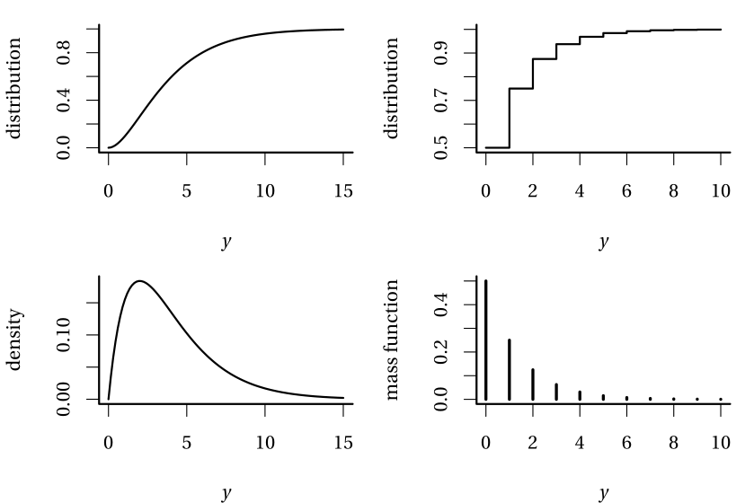

# Basic concepts {#complement}


## Population and samples {#population-sample}

Statistics is the science of uncertainty quantification: of paramount importance is the notion of randomness. Generally, we will seek to estimate characteristics of a population using only a sample (a sub-group of the population of smaller size).

The **population of interest** is a collection of individuals which the study targets. For example, the Labour Force Survey (LFS) is a monthly study conducted by Statistics Canada, who define the target population as "all members of the selected household who are 15 years old and older, whether they work or not." Asking every Canadian meeting this definition would be costly and the process would be long: the characteristic of interest (employment) is also a snapshot in time and can vary when the person leaves a job, enters the job market or become unemployed.

In general, we therefore consider only **samples** to gather the information we seek to obtain. The purpose of **statistical inference** is to draw conclusions about the population, but using only a share of the latter and accounting for sources of variability. George Gallup made this great analogy between sample and population: 

> One spoonful can reflect the taste of the whole pot, if the soup is well-stirred

A **sample** is a random sub-group of individuals drawn from the population. Creation of sampling plans is a complex subject and semester-long sampling courses would be required to evens scratch the surface of the topic. Even if we won't be collecting data, keep in mind the following information: for a sample to be good, it must be representative of the population under study. Selection bias must be avoided, notably samples of friends or of people sharing opinions.

Because the individuals are selected at **random** to be part of the sample, the measurement of the characteristic of interest will also be random and change from one sample to the next. However, larger samples of the same quality carry more information and our estimator will be more precise. Sample size is not guarantee of quality, as the following example demonstrates.

```{example, label="Galluppoll", title="Polling for the 1936 USA Presidential Election"}

*The Literary Digest* surveyed 10 millions people by mail to know voting preferences for the 1936 USA Presidential Election. A sizeable share, 2.4 millions answered, giving Alf Landon (57\%) over incumbent President Franklin D. Roosevelt (43\%). The latter nevertheless won in a landslide election with 62\% of votes cast, a 19\% forecast error. [Biased sampling and differential non-response are mostly responsible for the error:](https://www.jstor.org/stable/2749114)) the sampling frame was built using ``phone number directories, drivers' registrations, club memberships, etc.'', all of which skewed the sample towards rich upper class white people more susceptible to vote for the GOP.

In contrast, Gallup correctly predicted the outcome by polling (only) 50K inhabitants. [Read the full story here.](https://medium.com/@ozanozbey/how-not-to-sample-11579793dac)
```

## Random variable {#random-variable}

Suppose we wish to describe the behaviour of a stochastic phenomenon. To this effect, one should enumerate the set of possible values taken by the variable of interest and their probability: this is what is encoded in the distribution. We will distinguish between two cases: discrete and continuous variables. Random variables are denoted using capital letters: for example $Y \sim \mathsf{No}(\mu, \sigma^2)$ indicates that $Y$ follows a normal distribution with parameters $\mu$ and $\sigma^2$, which represent respectively the expectation and variance of $Y$. 

The (cumulative) distribution function $F(y)$ gives the cumulative probability that an event doesn't exceed a given numerical value $y$, $F(y) = \mathsf{Pr}(Y \leq y)$. 

If $Y$ is discrete, then it has atoms of non-zero probability and the mass function  $f(y)=\mathsf{Pr}(Y=y)$ gives the probability of each outcome $y$. In the continuous case, no numerical value has non-zero probability and so we consider intervals instead: the density function gives the probability of $Y$ falling in a set $B$, via $\mathsf{Pr}(Y \in B) = \int_B f(y) \mathrm{d} y$. It follows that the distribution function of a continuous random variable is simply $F(y) = \int_{-\infty}^y f(x) \mathrm{d} x$.

```{r distributions, fig.cap = "(Cumulative) distribution functions (top) and density/mass functions (bottom) of continuous (left) and discrete (right) random variables.", echo = FALSE} 

```


## Moments 

One of the first topics covered in introductory statistics is descriptive statistics such as the mean and standard deviation. These are estimators of (centered) moments, which characterise a random varaible. In the case of the standard normal distribution, the expectation and variance fully characterize the distribution.

Let $Y$ be a random variable with density (or mass) function $f(x)$. This function is non-negative and satisfies $\int_{\mathbb{R}} f(x) \mathrm{d}x=1$: the integral over a set $B$ gives the probability of $Y$ falling inside $B \in \mathbb{R}$.

The expectation of a continuous random variable $Y$ is \[\mathsf{E}(Y)=\int_{\mathbb{R}} x f(x) \mathrm{d} x.\] 
Expectation is the "theoretical mean" in the discrete case, we set rather $\mu = \mathsf{E}(Y)=\sum_{x \in \mathcal{X}} x \mathsf{Pr}(X=x)$, where $\mathcal{X}$ stands for the support of $Y$, which is the set of numerical values at which the probability of $Y$ is non-zero. More generally, we can look at the expectation of a function $g(x)$ for $Y$, which is nothing but the integral (or sum in the discrete case) of $g(x)$ weighted by the density or mass function of $f(x)$. In the same fashion, provided the integral is finite, the variance is
\[\mathsf{Va}(Y)=\mathsf{E}\{Y-\mathsf{E}(Y)\}^2 \equiv \int_{\mathbb{R}} (x-\mu)^2 f(x) \mathrm{d} x.\]

An estimator $\hat{\theta}$  for a parameter $\theta$ is unbiased if its bias $\mathsf{bias}(\hat{\theta})=\mathsf{E}(\hat{\theta})- \theta$ is zero.
The unbiased estimator of the mean of $Y$ is $\overline{Y}_n = n^{-1} \sum_{i=1}^n Y_i$ and that of the variance is $S_n = (n-1)^{-1} \sum_{i=1}^n (Y_i-\overline{Y})^2$. While unbiasedness of an estimator is a desirable property, but may not be optimal. There may even be cases where no unbiased estimator exists for a parameter!


Often, rather, we seek to balance  bias and variance: recall that an estimator is a function of random variables and thus it is itself random: even if it is unbiased, the numerical value obtained will vary from one sample to the next. We often seek an estimator that minimises the mean squared error, \[\mathsf{MSE}(\hat{\theta}) = \mathsf{E}\{(\hat{\theta}-\theta)^2\}=\mathsf{Va}(\hat{\theta}) + \{\mathsf{E}(\hat{\theta})\}^2.\]
The mean squared error is an objective function consisting of the sum of the squared bias and the variance. 

An alternative to this criterion is to optimize a function such as the likelihood of the sample: the resulting estimator is termed maximum likelihood estimator. These estimator are asymptotically efficient, in the sense that they have the lowest mean squared error of all estimators for large samples. Other properties of maximum likelihood estimators make them attractive default choice for estimation. 

The likelihood of a sample is the joint density of the $n$ observations, which requires a distribution to be considered. Many such distributions describe simple physical phenomena and can be described using a few parameters: we only cover the most frequently encountered.

 
```{example, label="bernoullidist", name="Bernoulli distribution"}
We consider a binary event such as coin toss (heads/tails). In general, the two events are  associated with success/failure. By convention, failures are denoted by zeros and successes by ones, the probability of success being $\pi$ so $\mathsf{Pr}(Y=1)=\pi$ and $\mathsf{Pr}(Y=0)=1-\pi$ (complementary event). The mass function of the [Bernoulli distribution](https://en.wikipedia.org/wiki/Bernoulli_distribution) is thus
\begin{align*}
\mathsf{Pr}(Y=y) = \pi^y (1-\pi)^{1-y}, \quad y=0, 1.
\end{align*}
A rapid calculation shows that $\mathsf{E}(Y)=\pi$ and $\mathsf{Va}(Y)=\pi(1-\pi)$.
Many research questions have binary responses, for example:

- did a potential client respond favourably to a promotional offer?
- is the client satisfied with service provided post-purchase?
- will a company go bankrupt in the next three years?
- did a study participant successfully complete a task?
  
```

```{example , label="binomialdist", name = "Binomial distribution"}
If the data five the sum of independent Bernoulli events, the number of sucessess $Y$ out of $m$ trials is [binomial](https://en.wikipedia.org/wiki/Binomial_distribution), denoted $\mathsf{Bin}(m, \pi)$; the mass function of the binomial distribution is
\begin{align*}
\mathsf{Pr}(Y=y) = \binom{m}{y}\pi^y (1-\pi)^{1-y}, \quad y=0, 1.
\end{align*}
The likelihood of a sample from a binomial distribution is (up to a normalizing constant that doesn't depend on $\pi$) the same as that of  $m$independent Bernoulli trials. The expectation of the binomial random variable is $\mathsf{E}(Y)=m\pi$ and its variance $\mathsf{Va}(Y)=m\pi(1-\pi)$. 

As examples, we could consider the number of successful candidates out of $m$ who passed their driving license test or the number of customers out of $m$ total which spent more than 10\$ in a store.

```

More generally, we can also consider count variables whose realizations are integer-valued, for examples the number of

- insurance claims made by a policyholder over a year,
- purchases made by a client over a month on a website,
- tasks completed by a study participant in a given time frame.

```{example, label = "geomdist", name = "Geometric distribution"}
The [geometric distribution](https://en.wikipedia.org/wiki/Geometric_distribution) is a model describing the number of Bernoulli trials with probability of success $\pi$ required to obtain a first success. The mass function of  $Y \sim \mathsf{Geo}(\pi)$ is
\begin{align*}
\mathsf{Pr}(Y=y) = \pi (1-\pi)^{y-1}, \quad y=1,2, \ldots
\end{align*}

For example, we could model the numbers of visits for a house on sale before the first offer is made using a geometric distribution.

```


```{example label = "poissondist", name = "Poisson distribution"}
If the probability of success $\pi$ of a Bernoulli event is small in the sense that $m\pi \to \lambda$ wen the number of trials $m$ increases, then the number of success followss approximately a Poisson distribution with mass function
\begin{align*}
\mathsf{Pr}(Y=y) = \frac{\exp(-\lambda)\lambda^y}{\Gamma(y+1)}, \quad y=0, 1, 2, \ldots
\end{align*}
where $\Gamma(\cdot)$ denotes the gamma function. The parameter $\lambda$ of the Poisson distribution is both the expectation and the variance of the distribution, meaning $\mathsf{E}(Y)=\mathsf{Va}(Y)=\lambda$.

```


```{example, label = "negbindist", name = "Negative binomial distribution"}
The negative binomial distribution arises as a natural generalization of the geometric distribution if we consider the number of Bernoulli trials with probability of success $\pi$ until we obtain $m$ success. Let $Y$ denote the number of failures: the order of success and failure doesn't matter, but for the latest trial which is a success. The mass function is thus 
\begin{align*}
\mathsf{Pr}(Y=y)= \binom{m-1+y}{y} \pi^m (1-\pi)^{y}.
\end{align*}

The negative binomial distribution also appears as the unconditional distribution of a two-stage hierarchical gamma-Poisson model, in which the mean of the Poisson distribution is random and follows a gamma distribution. In notation, this is $Y \mid \Lambda=\lambda \sim \mathsf{Po}(\lambda)$ and $\Lambda$ follows a gamma distribution with shape $r$ and scale $\theta$, whose density is \[f(x) = \theta^{-r}x^{r-1}\exp(-x/\theta)/\Gamma(r).\] The unconditional number of success is then negative binomial.


In the context of generalized linear models, we will employ yet another parametrisation of the distribution, with the mass function
\begin{align*}
\mathsf{Pr}(Y=y)=\frac{\Gamma(y+r)}{\Gamma(y+1)\Gamma(r)} \left(\frac{r}{r + \mu} \right)^{r} \left(\frac{\mu}{r+\mu}\right)^y, y=0, 1, \ldots, \mu,r >0,
\end{align*}
where $\Gamma$ is the gamma function and the parameter $r>0$ is not anymore integer valued. The expectation and variance of $Y$ are
$\mathsf{E}(Y)=\mu$ et $\mathsf{Va}(Y)=\mu+k\mu^2$, where $k=1/r$. The variance of the negative binomial distribution is thus higher than its expectation, which justifies the use of the negative binomial distribution for modelling overdispersion.
```


```{example, label = "studentdist", name = "Student-*t* distribution"}
If $X \sim \mathsf{No}(0,1)$ independent of  $Y \sim \chi^{2}_\nu$, then 
\begin{align*}
T = \frac{X}{\sqrt{Y/\nu}}
\end{align*}
follows a Student-$t$ distribution with $\nu$ degrees of freedom, denoted $\mathsf{St}_{\nu}$. The density of $T$ is
\begin{align*}
f(y; \nu) = \frac{\Gamma \left( \frac{\nu+1}{2}\right)}{\Gamma\left(\frac{\nu}{2}\right)
\sqrt{\nu\pi}}\left(1+\frac{y^{2}}{\nu}\right)^{-\frac{\nu+1}{2}}
\end{align*}
the distribution has polynomial tails, is symmetric around $0$ and unimodal. Its bell-curve shape resembles that of the normal distribution, and, as $\nu \to \infty$, the Student distribution converges to a normal distribution. It has heavier tails than the normal distribution and only the first $\nu-1$ moments of the distribution exist, so a Student distribution with $\nu=2$ degrees of freedom has infinite variance. 
```


### Quantiles-quantiles plots {#diagramme-qq}

Models are (at best) an approximation of the true data generating mechanism and we will want to ensure that our assumptions are reasonable and the quality of the fit decent. Quantile-quantile plots are graphical goodness-of-fit diagnostics that are based on the following principle: if $Y$ is a continuous random variable with distribution function $F$, then the mapping $F(Y) \sim \mathsf{U}(0,1)$ yields uniform variables. Similarly, the quantile transform applied to a uniform variable provides a mean to simulating samples from $F$, viz. $F^{-1}(U)$. Consider then a random sample of size $n$ from the uniform distribution ordered from smallest to largest, with  $U_{(1)} \leq \cdots \leq U_{(n)}$. One can show these ranks have marginally a Beta distribution, $U_{(k)} \sim \mathsf{Beta}(k, n+1-k)$ with expectation $k/(n+1)$.

In practice, we don't know $F$ and, even if we did, one would need to estimate the parameters. We consider some estimator $\widehat{F}$ for the model and apply the inverse transform to an approximate uniform sample $\{i/(n+1)\}_{i=1}^n$. The quantile-quantile plot shos the data as a function of the (first moment) of the transformed order statistics:

- on the $x$-axis, the theoretical quantiles $\widehat{F}^{-1}\{\mathrm{rank}(y_i)/(n+1)\}$
- on the $y$-axis, the empirical quantiles $y_i$

If the model is adequate, the ordered values should follow a straight line with unit slope passing through the origin. Whether points fall on a 45 degree line is difficult to judge by eye and so it is advisable to ease the interpretation to subtract the slope: the detrended plot is easier to interpret and was proposed by Tukey (but beware of the scale of the $y$-axis!). Figure \@ref(fig:diagrammeqq2) shows two representations of the same data using simulated samples from a standard normal distribution.

```{r diagrammeqq2, cache = TRUE, eval = TRUE, echo = FALSE, fig.cap = "Normal quantile-quantile plot (left) and detrended version (Tukey's) of the same plot (right)."}
library(qqplotr, warn.conflicts = FALSE)
library(patchwork)
set.seed(1234)
data <- data.frame(sample = rnorm(100))
di <- "norm"
dp <- list(mean = 0, scale = 1)
de <- TRUE
g2 <- ggplot(data = data, mapping = aes(sample = sample)) +
 stat_qq_band(distribution = di, detrend = de, bandType = "boot", B = 9999) +
 stat_qq_line(distribution = di, detrend = de) +
 stat_qq_point(distribution = di, detrend = de) +
 labs(x = "theoretical quantiles", y = "empirical minus\n theoretical quantiles")
de <- FALSE
g1 <- ggplot(data = data, mapping = aes(sample = sample)) +
 stat_qq_band(distribution = di, detrend = de, bandType = "boot", B = 9999) +
 stat_qq_line(distribution = di, detrend = de) +
 stat_qq_point(distribution = di, detrend = de) +
 labs(x = "theoretical quantiles", y = "empirical quantiles")
g1 + g2

```

Even if we knew the true distribution of the data, the sample variability makes it very difficult to spot if deviations from the model are abnormal or compatible with the model. A simple point estimate with no uncertainty measure can lead to wrong conclusions. As such, we add approximate pointwise or simultaneous confidence intervals. The simplest way to do this is by simulation (using a parametric bootstrap), by repeating the following steps $B$ times:

1. simulate a (bootstrap) sample $\{Y^{(b)}_{i}\} (i=1,\ldots, n)$ from $\widehat{F}$
2. re-estimate the parameters of $F$ to obtain $\widehat{F}_{(b)}$
3. calculate and save the plotting positions $\widehat{F}^{-1}_{(b)}\{i/(n+1)\}$.

The result of this operation is an $n \times B$ matrix of simulated data. We obtain a symmetric ($1-\alpha$) confidence interval by keeping the empirical quantile of order $\alpha/2$ and $1-\alpha/2$ from each row. The number $B$ should be larger than 999, say, and be chosen so that $B/alpha$ is an integer.

For the pointwise interval, each order statistic from the sample is a statistic and so the probability of any single one falling outside the confidence interval is approximately $\alpha$. However, order statistics are not independent (they are ordered), so its common to see neighboring points falling outside of their respective intervals. [It is also possible to use the bootstrap samples to derive an (approximate) simultaneous confidence intervals, in which we expected values to fall $100(1-\alpha)$\% of the time inside the bands in repeated samples; [see Section 4.4.3 of these course notes](https://lbelzile.github.io/lineaRmodels/qqplot.html). The intervals shown in Figure \@ref(fig:diagrammeqq2) are pointwise and derived (magically) using a simple function. The uniform order statistics have larger variability as we move away from 0.5, but the uncertainty in the quantile-quantile plot largely depends on $F$.


Interpretation of quantile-quantile plots requires some experience: [this post by _Glen_b_ on StackOverflow](https://stats.stackexchange.com/questions/101274/how-to-interpret-a-qq-plot/101290#101290) nicely summarizes what can be detected (or not) from them.


## Laws of large numbers {#law-large-numbers}

An estimator for a parameter $\theta$ is **consistent** if the value obtained as the sample size increases (to infinity) converges to the true value of $\theta$. Mathematically speaking, this translates into convergence in probability, meaning $\hat{\theta} \stackrel{\mathsf{Pr}}{\to} \theta$. In common language, we say that the probability that $\hat{\theta}$ and $\theta$ differ becomes negligible as $n$ gets large.

Consistency is the _a minima_ requirement for an estimator: when we collect more information, we should approach the truth. The law of large number states that the sample mean of $n$ (independent) observations with common mean $\mu$, say $\overline{Y}_n$, converges to $\mu$, denoted $\overline{Y}_n \rightarrow \mu$. Roughly speaking, our approximation becomes less variable and asymptotically unbiased as the sample size (and thus the quantity of information available for the parameter) increases. The law of large number is featured in Monte Carlo experiments: we can approximate the expectation of some (complicated) function $g(x)$ by simulating repeatedly independent draws from $Y$ and calculating the sample mean $n^{-1} \sum_{i=1}^n g(Y_i)$.

If the law of large number tells us what happens in the limit (we get a single numerical value), the result doesn't contain information about the rate of convergence and the uncertainty at finite levels.


## Central Limit Theorem {#CLT}

The central limit theorem is perhaps the flagship result of probability theory: for a random sample of size $n$ with (independent) random variables whose expectation is  $\mu$ and variance $\sigma^2$, then the sample mean converges to $\mu$, but 

- the estimator $\overline{Y}$ is centered around $\mu$,
- the standard error is $\sigma/\sqrt{n}$; the rate of convergence is thus $\sqrt{n}$. For a sample of size 100, the standard error of the sample mean will be 10 times smaller than that of the underlying random variable.
- the sample mean, once properly scaled, follows approximately a normal distribution

Mathematically, the central limit theorem states $\sqrt{n}(\overline{Y}-\mu) \stackrel{\mathrm{d}}{\rightarrow} \mathsf{No}(0, \sigma^2)$. If $n$ is large (a rule of thumb is $n>30$, but this depends on the underlying distribution of $Y$), then $\overline{Y} \stackrel{\cdot}{\sim} \mathsf{No}(\mu, \sigma^2/n)$.

How do we make sense of this result? Let us consider the mean travel time of high speed Spanish trains (AVE) between Madrid and Barcelona that are operated by Renfe.

```{r renfeclt, echo = FALSE, fig.cap="Empirical distribution of travel times of high speed trains.", fig.width = 6, fit.height = 5}
url <- "https://lbelzile.bitbucket.io/MATH60604/renfe.sas7bdat"
renfe <- haven::read_sas(url)[,c("type","duree")]
duree <- renfe$duree[renfe$type %in% c("AVE","AVE-TGV")]
ggplot(data = data.frame(duree), aes(x=duree)) + 
  geom_bar() + 
  xlab("duration (in minutes)") +
  ylab("frequency")
```

Our exploratory data analysis showed previously that the duration is the one advertised on the ticket: there are only `r length(sort(unique(duree)))` unique travel time. Based on `r length(duree)` observations, we estimate the mean travel time to be `r as.integer(floor(mean(duree)))` minutes and `r as.integer(round(mean(duree)%% 1 * 60,0))` seconds. Figure \@ref(fig:renfeclt) shows the empirical distribution of the data.

Consider now samples of size $n=10$, drawn repeatedly from the population: in the first sample, the sample mean is `r mean(sample(duree, 10L))` minutes, whereas we get an estimate of `r mean(sample(duree, 10L))` minutes in our second , `r mean(sample(duree, 10L))` minutes in the third, etc.


```{r renfemeanCLT, echo = FALSE, fig.cap="Graphical representation of the central limit theorem. The upper left panel shows a sample of 20 observations with its sample mean (vertical red). The three other panels show the histograms of the sample mean from repeated samples of size 5 (top right), 20 (bottom left) and 20, 50 and 100 overlaid, with the density approximation provided by the central limit theorem.", fig.width = 8, fit.height = 10, out.width = '90%'}
set.seed(1234)
moy5 <- data.frame(moy = replicate(n = 10000, expr = mean(sample(duree, size = 5, replace = FALSE))))
moy20 <- data.frame(moy = replicate(n = 10000, expr = mean(sample(duree, size = 20, replace = FALSE))))
moy100 <- data.frame(moy = replicate(n = 20000, expr = mean(sample(duree, size = 100, replace = FALSE))))

p0 <- ggplot(data = (df20 <- data.frame(duree = sample(duree, 20))), aes(x=duree)) + 
  geom_bar() + 
  geom_vline(xintercept = mean(df20$duree), col = "red") + 
  xlab("duration (in minutes)") +
  ylab("frequency")

p1 <- ggplot(data = moy5) + 
  geom_histogram(bins = 30, aes(x=moy, y=..density..), alpha = 0.2) + 
  stat_function(fun = dnorm, col = "blue", args = list(mean = mean(duree), sd = sqrt(var(duree))/sqrt(5)), n = 1000) + 
  xlab("average duration (in minutes)") +
  ylab("density")

p2 <- ggplot(data = moy20) + 
  geom_histogram(data = moy20, bins = 30, aes(x=moy, y=..density..), alpha = 0.2) + 
  stat_function(fun = dnorm, col = "blue", args = list(mean = mean(duree), sd = sqrt(var(duree))/sqrt(20)), n = 1000) + 
  xlab("average duration (in minutes)") +
  ylab("density")

p3 <- ggplot(data = moy100) + 
  geom_histogram(bins = 50, aes(x=moy, y=..density..), alpha = 0.2) + 
  stat_function(fun = dnorm, col = "blue", args = list(mean = mean(duree), sd = sqrt(var(duree))/10), n = 1000)  + 
  geom_histogram(data = moy20, bins = 30, aes(x=moy, y=..density..), alpha = 0.2) + 
  stat_function(fun = dnorm, col = "blue", args = list(mean = mean(duree), sd = sqrt(var(duree))/sqrt(20)), n = 1000) + 
   geom_histogram(bins = 30, aes(x=moy, y=..density..), alpha = 0.2) + 
  stat_function(fun = dnorm, col = "blue", args = list(mean = mean(duree), sd = sqrt(var(duree))/sqrt(5)), n = 1000) + 
  xlim(c(142,198)) + 
  xlab("average duration (in minutes)") +
  ylab("density")


cowplot::plot_grid(p0, p1, p2, p3)
```

We draw $B=1000$ different samples, each of size $n=5$, from two millions records, and calculate the sample mean in each of them. The top right panel of  \@ref(fig:renfemeanCLT) shows the result for $n=5$, but also for $n=20$ (bottom left). The last graph of Figure \@ref(fig:renfemeanCLT) shows the impact of the increase in sample size: whereas the normal approximation is okay-ish for $n=5$, it is indistinguishable from the normal approximation for $n=20$. As $n$ increases and the sample size gets bigger, the quality of the approximation improves and the curve becomes more concentrated around the true mean. Even if the distribution of the travel time is discrete, the mean is approximately normal.

We considered a single distribution in the example, but you could play with other distributions and vary the sample size to see when the central limit theorem kicks in usng this [applet](http://195.134.76.37/applets/AppletCentralLimit/Appl_CentralLimit2.html).

The central limit theorem underlies why scaled test statistics which have sample mean zero and sample variance 1 have a standard null distribution in large sample: this is what guarantees the validity of our inference!

